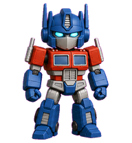
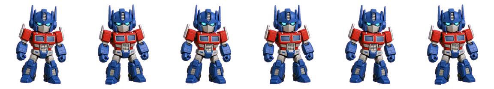

<p align="center">
  
</p>

<h1 align="center">Mini Prime — Claude Code 桌面宠物</h1>

<p align="center">
  <strong>一个红蓝机甲小机器人，在你的 Claude Code 终端旁边蹦跶</strong>
</p>

<p align="center">
  
  
  
</p>

---

## 这是什么？

Mini Prime 是一个 Claude Code 宠物 skill。当你使用 Claude Code 时，一个红蓝机甲小机器人会以**浮动窗口**的形式出现在屏幕上，根据 Claude Code 的状态做出不同的动作：

- 🤖 **idle** — 呼吸眨眼待机
- 🏃 **running** — Claude 正在思考/工作
- ⏳ **waiting** — 等待你的确认
- ❌ **failed** — 遇到问题
- ✅ **review** — 完成检查
- 👋 **waving** — 上线打招呼
- 🎯 **jumping** — 响应中
- ➡️ **running-left/right** — 拖拽窗口时

## 快速开始

### 1. 安装

将项目目录链接到 Claude Code 的 skills 路径：

```bash
ln -s /path/to/desktop-pet-skill ~/.claude/skills/desktop-pet-skill
```

### 2. 配置 hooks

将 `docs/settings-hooks-snippet.json` 的内容合并到你的 `~/.claude/settings.json` 中。

### 3. 启动

在 Claude Code 中输入：

```
/prime
```

Mini Prime 就会出现在屏幕上了！

---

## 项目结构

```
├── docs/                      # 文档
│   ├── README.md              # 详细说明
│   ├── INSTALL.md             # 安装指南
│   └── settings-hooks-snippet.json
├── hooks/
│   └── dispatch.sh            # 会话事件分发脚本
├── prime-command/
│   └── prime.md               # /prime 命令定义
└── source/
    ├── MiniPrimeFloating.swift # macOS 悬浮窗
    ├── floating.html           # 宠物渲染界面
    ├── hook.js                 # Claude Code 事件→宠物状态映射
    ├── assets/
    │   ├── spritesheet.webp   # 精灵图（1536×1872，72帧）
    │   └── pet.json           # 宠物动画配置
    └── bin/
        └── claude-mini-prime   # 启动脚本
```

## 动画状态

| 状态 | 说明 | 帧数 |
|------|------|------|
| idle | 待机呼吸眨眼 | 6 |
| running | 工作中 | 6 |
| waiting | 等待输入 | 6 |
| failed | 失败反应 | 8 |
| review | 完成检查 | 6 |
| waving | 打招呼 | 4 |
| jumping | 跳跃 | 5 |
| running-right | 右移 | 8 |
| running-left | 左移 | 8 |

<p align="center">
  
  <br>
  <em>running 状态动画（6帧）</em>
</p>

## 设计理念

- 一个 Claude 会话对应一个 Mini Prime 实例
- 退出 Claude 时自动清理对应宠物
- 不是全局自动启动
- 不是所有终端共享一个宠物

---

<p align="center">
  由 <a href="https://github.com/1400621504-lang">1400621504-lang</a> 制作 · 灵感来自 Transformers
</p>
